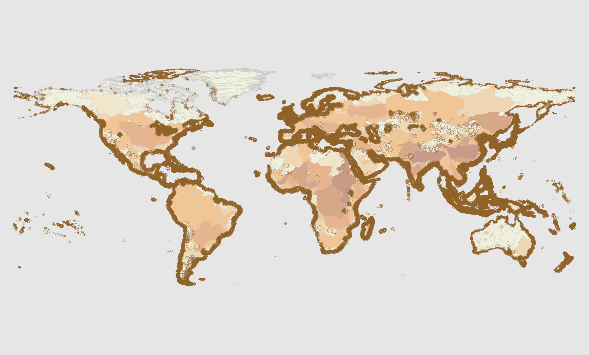

```{r setup, include=FALSE}
library(tidyverse)
library(ggplot2)
library(sf)
# Set all the file paths and bash Env variables 
source("./file_names.R")
```

We want to map how human wastewater impacts coastal oceans globally. So we'll take world-wide country-level [sanitation data](https://github.com/jkibele/wastewater/issues/3#issuecomment-460335655), combine it with population density data to estimate human waste likely to make it into the ocean, aggregate those numbers by watershed, and map the plumes of waste as they enter the ocean. Broadly, the steps will be:

1. Develop national "sanitation factors" (sf) for each country. These values will range between 1 (representing unprocessed waste - basically just open defecation) and 0 (at least theoretically, representing a perfect sanitation system in which no human waste reaches the ocean).
2. Rasterize sf values and multiply them by population density raster to produce "effluent density".
3. Use a vector representation of watersheds to aggregate effluent density to coastal pour points.
4. Plume modelling to represent diffusion into the coastal ocean.

This document serves as an outline of the methods used, but its primary purpose is as a guide for anyone (hopefully me) who wants to re-run or build on this analysis later.

## Datasets

The data sets used in this analysis are detailed [here](datasets.html).

## 1) Sanitation Factors

These factors represent waste reduction. We'll need to develop the factors, map them to geography, then rasterize the output.

#### Factor Development
These values were developed in the [`sanitation_factors.Rmd`](sanitation_factors.html). Here they are joined to the relevant sanitation data (far right column).

```{r sf_disp, cache=FALSE, echo=FALSE, warning=FALSE, message=FALSE}
sanit <- read_csv(sanit_factors_fn)
options(knitr.kable.NA = '--')
# Just display a table to show where we're at
sanit %>% 
  kableExtra::kable(digits = 2) %>% 
  kableExtra::add_header_above(c(" " = 4, "National" = 4, "Breakdown of Basic" = 7, " " = 1)) %>% 
    kableExtra::kable_styling(
      bootstrap_options = c("striped", "hover")
    ) %>% 
  kableExtra::scroll_box(width = "100%", height = "300px") 
```

#### Mapped to Geography

After [careful consideration](world_vector_choice.html), we decided to use the [GADM](datasets.html#gadm) and [World EEZs](datasets.html#world-eezs). The vectors were combined, the $sf$ values were joined and then rasterized. The processing took place in [this notebook](world_vector_prep.Rmd). Here's the raster output of $sf$ values:

```{r plot_raster, echo=FALSE, message=FALSE, warning=FALSE}
library(raster)

ff_rast <- raster::raster(ff_raster_fn)

pp_palette <- colorRampPalette(c("white", "yellow","brown"))
ff_rast %>% 
  plot(col = pp_palette(9))

# re-load these packages because raster steps on their namespace
library(tidyverse)
library(sf)
```

## 2) Effluent Density

The $sf$ values calculated in the previous steps were mulitplied by the population density to produce a raster of effluent density. For each cell, this results in a number assumed to be proportional to the density of nutrient/pathogen production originating within the cell. Derivation of this layer is covered in [another notebook](effluent_density.html).

```{r plot_effluent, echo=FALSE, message=FALSE, warning=FALSE}
effluent <- raster(effluent_fn)

pp_palette <- colorRampPalette(c("yellow","brown"), bias=1)
brk <- seq(0, 300, length.out = 9)
effluent %>% 
  plot(col=pp_palette(9), breaks=brk)
```

## 3) Aggregate to Pour Points

The effluent density raster was summed across watersheds. These watershed totals were then attributed to pour points representing river mouths were the watersheds enter the ocean.

Caveat: The density raster was not converted to population (dividing each cell by area) before the cells were summed. Cells near the equator would be essentially unchanged (because cells near the equator are very close to $1 km^2$), but cells closer to the poles will be a bit biased. This will be addressed in any future version of this analysis.

<!-- I may try this in R at some point, but for now I'm just going to run it in Python because I'm pretty sure it's going to be a lot faster. It still take a while, so I've put this code into it's own script and run in the background. The code below is set to display, but not run so this notebook doesn't take forever to knit. -->


```{python eval=FALSE, engine.path="/usr/bin/python3", include=TRUE}
from rasterstats import zonal_stats, gen_zonal_stats
import numpy as np
import pandas as pd
import geopandas as gpd
import rasterio
import os

data_dir = "/home/shares/ohi/git-annex/land-based/wastewater"
intermediate_dir = os.path.join(data_dir, "intermediate_files")
basins_dir = os.path.join(data_dir, "basins_laea")
shps = [os.path.join(basins_dir, fn) for fn in os.listdir(basins_dir) if fn.endswith(".shp")]
effluent_fn = os.path.join(intermediate_dir, "effluent_density.tif")
output_fn = os.path.join(intermediate_dir, "effluent_watersheds.shp")

feature_list = []
for shp_fn in shps:
    watersheds = gpd.read_file(shp_fn).to_crs(epsg=4326)
    zs_feats = zonal_stats(watersheds, effluent_fn, stats="sum count", geojson_out=True)
    feature_list.extend(zs_feats)
    
zgdf = gpd.GeoDataFrame.from_features(feature_list, crs=watersheds.crs)
zgdf = zgdf.rename(columns={'sum': 'effluent'})
zgdf.effluent = zgdf.effluent.fillna(0)
zgdf.to_file(output_fn)
```


Here's a quick plot to (sort of) show how "dirty" the watersheds are. It's a really skewed distribution, so I'll plot $log(x+1)$. Otherwise the color scale isn't very useful.

```{r watershed_plot, echo=FALSE, cache=TRUE}
psheds <- sf::read_sf(effluent_watersheds_fn)

ggplot() +                                                                          
  geom_sf(data = psheds %>% filter(area > 100),                                                      
          aes(fill = effluent),                                       
          alpha = 0.8,                                                              
          colour = 'white',                                                         
          size = 0.3) + 
  scale_fill_gradient2(low='yellow', mid='orange', high='brown', trans='log1p') +                    
  labs(x = NULL, y = NULL) +  
  theme(panel.background = element_blank(),                                       
        line = element_blank(),                                                     
        axis.text = element_blank(),                                                
        axis.title = element_blank()) +                                         
  coord_sf(datum = NA) 

```

```{r}
ggplot(psheds, aes(log1p(effluent))) +
  geom_density()
```

#### Pour Points Mapped



## 4) Plume Modeling and Tile Rendering

The old version of the plume model would not work in GRASS version 7.6, so that code was updated. An ocean mask was created from the GADM with 1s for ocean cells and null values for land. There was also a [tricky bug](https://github.com/jkibele/wastewater/issues/11) to be fixed. The plume model took around 10 hours or so to run.

The raw plume raster was sybolised and rendered to RGB in QGIS and turned into tiles using the QTiles QGIS plugin. The impact raster was also rendered in QGIS, but the tiles were cut using gdal2tiles because QTiles crashed repeatedly. The code to create the leaflet map is in [webmap.R](../code/webmap.R). Full screen web map [here](webmap.html). 

```{r webmap, echo=FALSE}
source("./webmap.R")

make_webmap()
```


## Next Steps & Potential Enhancements

For a more complete, and less tech focused list of next steps, please see the accompanying report document.

#### Gap Filling

```{r find_gaps, echo=FALSE, cache=TRUE}
# re-load these packages because raster steps on their namespace
library(tidyverse)
library(sf)
# wv <- sf::read_sf(world_vector_fn)

gvars = c(ISO3="GID_0", name="NAME_0")
gadm_names <- sf::read_sf(gadm_fn) %>% 
  dplyr::select(!!gvars) %>% 
  as_tibble() %>% 
  dplyr::select(-geometry) %>% 
  distinct(ISO3, name)

scroll_disp <- function(dat, title=NA) {
  ootpoot <- dat %>% 
    kableExtra::kable(digits = 2, caption = title) %>% 
    kableExtra::kable_styling(
      bootstrap_options = c("striped", "hover")
    ) %>% 
    kableExtra::scroll_box(width = "100%", height = "400px")
  return(ootpoot)
}

gaps <- gadm_names %>% 
  as_tibble() %>% 
  filter(!(gadm_names$ISO3 %in% sanit$ISO3))

gaps %>% 
  scroll_disp(sprintf("%i Countries in GADM but not in Sanitation data", base::nrow(gaps)))
```


```{r region_gaps, eval=FALSE, include=FALSE}
# I was just curious about this, but we're not using the OHI regions, so it's not super relevant
# There were 52 country codes in the OHI regions that were not in the sanitation data, but many
# aren't actually countries, so it's not surprising
regs <- sf::read_sf(reg_fn)
rvars <- c(ISO3="rgn_key", name="rgn_name")
reg_names <- regs %>% 
  dplyr::select(!!rvars) %>% 
  as_tibble() %>% 
  dplyr::select(-geometry) %>% 
  distinct(ISO3, name)

reg_gaps <- reg_names %>% 
  as_tibble() %>% 
  filter(!(reg_names$ISO3 %in% sanit$ISO3))

reg_gaps %>% 
  scroll_disp(sprintf("%i Countries in OHI Regions but not in Sanitation data", base::nrow(reg_gaps)))
```

#### Plume Model Improvements

The current plume model describes effluent concentration as a function of distance from the pour point regardless of surface area. This means that at a given distance from a pour point, the concentration is the same regardless of whether you're at a headland of up a narrow fjord. By incorporating both surface area and distance, we could more realistically model dispersion.

From a purely operational standpoint, the plume model could be sped up considerably. In it's current form, it writes a huge number of intermediate raster files. This creates an IO bottleneck. So, regardless of how much RAM and how many processors are allocated, it still won't run any faster. If re-written to reduce disk access and exploit parallel processing the code could run much, much faster. In turn, this would allow us to much more easily make small adjustments and re-run the model.

<!-- #### Urban / Rural Split -->

<!-- The sanitation data includes different figures for urban and rural areas for many countries. We could potentially refine our results by incorporating land use data to split our population figures into rural and urban and come up with different sanitation factors for those countries that have these data available. -->

<!-- #### Septic Systems -->

<!-- The location and efficacy of septic systems could be included. -->

<!-- #### Pathogens vs. Nutrients -->

<!-- We could model how treatment levels reduce pathogens and nutrient inputs separately. -->

<!-- #### Incorporating Terrestrial Absorption -->

<!-- Our current methods assume that all untreated effluent (in watersheds with drainage) makes it into the ocean regardless of terrain, land cover, and distance from waterways.  -->

<!-- #### Ocean Currents -->

<!-- Our current plume modeling does not account for currents. If global data on currents are available at a suitable resolution we could try to incorporate them. -->

<!-- #### Ranking Wastewater Impacts Against Other Stressors -->

<!-- OHI team can speak to this. -->

<!-- #### Potential Ecosystem Responses -->

<!-- By incorporating ecosystem maps, we may be able to map some of the specific consequences of effluent discharge. We may also be able to look at regions in peril based on effluent tipping points? -->
